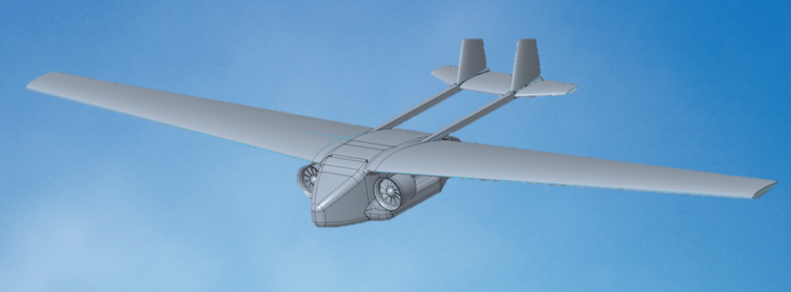

# ImechE-UAS-2025

## Project Overview
- This project was University of Leicester's entery into IMechE UAS Challenge 2025
- As a team we had to design and build a UAV meant for humanitarian aid package delivery
- I was assigned to be the Design and CAD team lead by the school of engineering, meaning I led the concept developement, modelling and the manufacturing
  

*(Figure 1: Isometric view of the high-wing, dual-boom concept design.)*

## Design Constraints & Competition Requirements
- The following are based on the competition rule book which is available in the project folder
- **Mission Objective:** Autonomous payload delivery into a simulated disaster zone
- **Maximum Take-Off Mass (MTOM):** Maximum 10 kg total mass, this includes the 2 kg payload so the mass of aircraft shall not exceed 8 kg
- **Storage:** The entire disassembled UAS should fit in a transport box with specific dimendions. Considering how the longest dimension of the container is 1500 mm, aircraft wings' longest spars shall not exceed that, manufacturing tolerance to be considered
- **Clean & Safe Release:** The payload delivery system must disengage smoothly without risking structural entanglement, wild CoG (Center of Gravity) shifts, or instability
- **Regulatory Compliance:** Designed in accordance with UK Civil Aviation Authority (CAA) safety standards for Visual Line of Sight (VLOS) operations

## ✈️ Concept Developement & Design Decisions

### 1. Airframe
* **Trade-off Analysis:** As a debut team with limited budget, a **fixed-wing configuration** was the better option over a multi-rotor system
*  Fixed-wings offer significantly higher power-to-range efficiency per Watt-hour, reducing battery cell count and total BOM cost and maintaining extended endurance

### 2. Propulsion
* **Configuration:** Dual fuselage-mounted Electric Ducted Fan
* The twin-EDF setup was chosen for high thrust, reduced exposed rotational risk during field drops in comparison to front-mounted engines, and showed better system integriy in aerodynamic analysis. The judges loved this!

### 3. Wing Configuration: High-Wing 
* **Lateral Stability (Pendulum Effect):** Positioning the wing above the fuselage lowers the aircraft’s Center of Gravity relative to the Center of Lift  creating inherent roll restoration and flight stability
* And just like commercial aircrafts, high-wing setup provides ground clearance and protects the low-mounted EDFs
* This configuration also fit our payload enclosure the best by increasing internal volume within the fuselage 

### 4. Tail Assembly
* **Direct Load Pathing:** We chose double-boom layout since it directly absorbs and distributes axial thrust loads from the twin EDF units into the tail controls
* Aerodynamically speaking, double-boom isolates the empennage from EDF exhaust wash, improving control surface performance
  

### 5. Payload Integration & Release Mechanism   
* **In-Fuselage Packaging:** Instead of using hanging hooks or belly pods, the payload was stored completely **inside a dedicated internal fuselage cavity**
This eliminates parasite drag ($C_{D,0}$) and flow separation caused by suspended payloads, prevents pendulum effects and CoG change during high-wind transit or maneuvering, and shields humanitarian packages from weather and turbulence
A **Joule Heating Solid-State Release System** was engineered with the help of Avionics Team, The internal payload was secured via a polymer restraint element, upon reaching the target drop coordinates, a circuit pulse passed a calculated electrical current through an embedded resistive micro-element
- No moving parts = No mechanical jamming
- No aero drag
- No mechanical wear or electrical stall = Fail-safe
- Almost weightless compared to the whole aircraft
- Read more about this under the "Main Challenge" header 

### 6. Aerodynamic Spice ✨
* Implemented sharklet winglets...at first because it looked cool but after simulations we validated **8% increase in aerodynamic efficiency ($L/D$ ratio)** over the baseline wings!

## ⚠️ Main Challenge
Keeping the fuselage hollow for the payload package integration meant we were unable to incooperate a traditional bulky wing-box 
* **Solution:** Engineered a high-load wing-to-fuselage joint interface.
* Different scenarios of static and dynamic load testing was conducted to validate structural integrity across extreme $g$-load maneuvers 
> *Note: Specific structural joint schematics and FEA stress distribution data are withheld due to team proprietary design protocols*
